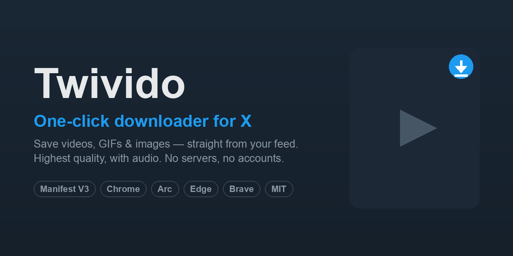

<div align="center">



# Twivido

**Download videos, GIFs and images from X (Twitter) in one click — right from your feed.**

[](https://github.com/k41n/twivido/actions/workflows/release.yml)
[](./LICENSE)
[](https://github.com/k41n/twivido/releases/latest)

</div>

Twivido is a tiny, no-nonsense browser extension that adds a **⬇ download button**
to every video, GIF and image on **x.com** / **twitter.com** — in the timeline, on
tweet pages, everywhere. No ads, no trackers, no accounts, no external servers.

## Features

- **One click, from the feed** — no need to open the tweet separately.
- **Videos & GIFs in the best quality, with audio** — always grabs the best MP4 (video **and** sound).
- **Images at original resolution** — full-size, not the compressed preview.
- **Zero setup** — no login, no API keys, no paste-the-link boxes.
- **Private** — everything runs locally in your browser; nothing is sent anywhere except X itself.
- **Cross-browser** — works in **Arc**, Chrome, Edge, Brave and any Chromium browser.

## Demo

Hover any media in a tweet — a **⬇** button appears in the corner. Click it, done.

<div align="center">
  
</div>

<sub>Recorded on live x.com with the extension loaded — reproduce it yourself with `npm run demo`.</sub>

## Install

Twivido isn't on the Web Store yet (submission is set up — see
[PUBLISHING.md](./PUBLISHING.md)). Install it manually in ~30 seconds:

1. Download **[`twivido-latest.zip`](https://github.com/k41n/twivido/releases/download/latest/twivido-latest.zip)** (or grab it from the [latest release](https://github.com/k41n/twivido/releases/latest)) and unzip it.
2. Open your browser's extensions page:
   - Arc / Chrome / Brave → `chrome://extensions`
   - Edge → `edge://extensions`
3. Enable **Developer mode**.
4. Click **Load unpacked** and select the unzipped folder.

That's it. Open X, hover any video, and click the **⬇** button in its corner.

> A signed `.crx` is also attached to each release for environments that support it.

## How it works

X streams tweet videos as HLS with **separate** audio and video tracks, so
downloading a raw track gives you either silence or no picture. Instead, Twivido
reads the tweet ID from the page and asks X's **public syndication endpoint** for
the tweet's progressive **MP4 (audio + video muxed)** — plus original-resolution
image URLs — then saves them via your browser's download manager. GIFs are served
by X as MP4, so they come through the same path. No transcoding, no third-party service.

## Limitations

- Works with **public** tweets (the syndication endpoint only serves those).
- Downloads the best quality X provides for that tweet.

## Build from source

```bash
npm install
npm run check     # validate manifest + JS
npm run build     # → dist/twivido-<version>.zip (+ .crx if a signing key is present)
```

The signing key is read from `$CRX_KEY` (PEM contents), `$CRX_KEY_PATH`, or
`./signing-key.pem`. Releases are built automatically by GitHub Actions on every
push to `main`.

Regenerate the demo GIF (needs a Chromium for Playwright and `ffmpeg`):

```bash
npx playwright install chromium
npm run demo      # loads the extension on a real tweet → docs/demo.gif
```

## Contributing

Issues and PRs are welcome. X changes its markup often — if the button stops
appearing somewhere, please open an issue with the page/URL.

## Disclaimer

For personal use only. Respect copyright and X's Terms of Service. Not affiliated
with X Corp.

## License

[MIT](./LICENSE) © k41n
